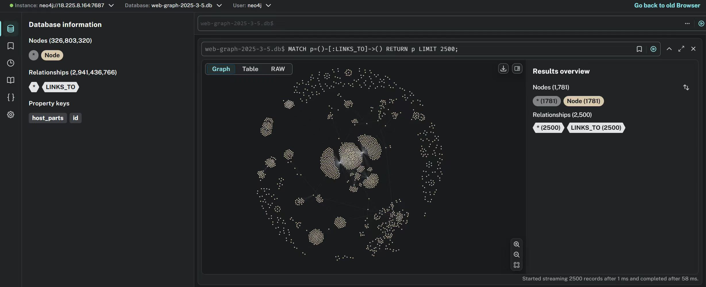

# cc-web-graph-neo4j

This repo contains documentation and code related to the Common Crawl
Foundation's [Web Graphs](https://commoncrawl.org/web-graphs),
stored in a [Neo4j graph database](https://neo4j.com/).
We have been
computing these web graphs since 2018, and currently every crawl has
a web graph covering the previous 3 crawls.

These graphs are computed by the
[WebGraph Framework](https://webgraph.di.unimi.it/). Historically
CCF only distributed these graphs in a not-commonly-used format.
This repo contains both instructions for using the graphs
in neo4j form, and also code to convert from Web Graph Framework
format to neo4j.

## Status

This project is in beta-testing. Please give it a try with the one
domain graph we've converted, and tell us how it went!

Eventually we will provide all of our web graphs in neo4j format.

## Motivation

These papers give good examples of what web graphs are useful for:

- Bharat, Krishna, et al. "Who links to whom: Mining linkage between web sites." Proceedings 2001 IEEE International Conference on Data Mining. IEEE, 2001.
- Somboonviwat, Kulwadee, Masaru Kitsuregawa, and Takayuki Tamura. "Simulation study of language specific web crawling." 21st International Conference on Data Engineering Workshops (ICDEW'05). IEEE, 2005.
- Lehmberg, Oliver, Robert Meusel, and Christian Bizer. "Graph structure in the web: aggregated by pay-level domain." Proceedings of the 2014 ACM conference on Web science. 2014.

## Hardware Requirements

We recommend 2–4 CPU cores or more, 16–32 GB of memory, and ample
storage -- 512GB to 1TB.

## Docker container

These instructions set up a Neo4j image inside a docker container. 
The container is configured to accept exec operations as described in this README.

```
mkdir -p data/neo4j_db data/import data/export logs plugins
PW=asdfasdf CONAME=web-graph-neo4j bash create.sh
docker stop web-graph-neo4j
```

> [!IMPORTANT]
> Buglet: `logs/`, `data/neo4j_db` end up owned by user:group 7474:7474

The proper way to fix the permissions is to create a user with that uid/gid on the host and chown the directories to that user.
```shell
sudo groupadd -g 7474 neo4j
sudo useradd -u 7474 -g 7474 neo4j; 
sudo chown -R neo4j:neo4j data logs
```
You could also add your own user to group neo4j for simplified access.

At this point you have a container (with Neo4J not running yet) that you can stop and start and run commands in. 
For example,

```
docker start web-graph-neo4j
docker exec web-graph-neo4j ls /data
docker stop web-graph-neo4j
```

Also, note that there are 3 special directories on the local disk, one for the neo4j database, one for incoming files, and one for files created by running commands in the container. These are:

- data/neo4j_db
- data/import
- data/export

## Download and use an existing neo4j web graph

Our pre-made neo4j format web graphs are stored as neo4j dump files. 
To use them, you'll have to download the dumps, and then load them.

### Download

```
wget https://data.commoncrawl.org/projects/web-graph-testing/v1/cc-main-2025-oct-nov-dec-domain-system.dump
wget https://data.commoncrawl.org/projects/web-graph-testing/v1/cc-main-2025-oct-nov-dec-domain-neo4j.dump
```

or from inside AWS:

```
s3://commoncrawl/projects/web-graph-testing/v1/cc-main-2025-oct-nov-dec-domain-system.dump
s3://commoncrawl/projects/web-graph-testing/v1/cc-main-2025-oct-nov-dec-domain-neo4j.dump
```

### Load

This step turns the dump files into a neo4j database. Note that the database will be about 2.5X the size of the dump.

Move the dumps in the import directory 
```shell
mv cc-main-2025-oct-nov-dec-domain-system.dump data/import/system.dump
mv cc-main-2025-oct-nov-dec-domain-neo4j.dump data/import/neo4j.dump
```

> [!IMPORTANT]
> Load and dump operations should always be performed with Neo4J in offline mode, or stopped.
> You can check using `docker exec web-graph-neo4j neo4j status`

Load the system and neo4j databases:
```shell
docker start web-graph-neo4j
docker exec web-graph-neo4j neo4j-admin database load --expand-commands system --from-path=/import --overwrite-destination=true
docker exec web-graph-neo4j neo4j-admin database load --expand-commands neo4j --from-path=/import  --overwrite-destination=true
docker stop web-graph-neo4j
```

At this point, you should see the unpacked database in `data/neo4j_db`. If you like, you can now remove the 2 dump files in import/

### Use

The container is configured to sleep infinitely, after starting, you can "exec" to start up neo4j:

```shell
docker exec web-graph-neo4j neo4j start
```

After, you can access it with a browser at https://localhost:7474/

If you want to run scripts against neo4j, write the output into /export

The web dashboard looks like:
<p align="center">
  
</p>

## Making your own dump

... end edit


## How to Use the Conversion Tools

- Step 1: (Prepare Web Graph)

**Host-level Web Graph**: place the two path lists (`cc-main-…-host-vertices.paths.gz` and `cc-main-…-host-edges.paths.gz`) in `data/` folder.
**Domain-level Web Graph**: place the two compressed text files (`cc-main-…-vertices-edges.txt.gz` and `cc-main-…-domain-edges.txt.gz`) in `data/` folder.
They can be accessed from [Common Crawl Web Graphs](https://commoncrawl.org/web-graphs).

- Step 2: (Setting and Environment)

Set up the environment (e.g., using bash `setup.sh` provided). Then go to settings.py and make any edits you need. Otherwise, only change variable `RELEASE` and `GRAPH_KIND` to match your current Web Graph and leave all other variables as default.

- Step 3: (CSV Conversion)

Run `pull.py` to download the original web graph in txt format, then run `neo4j_Convertor.py` to convert it into the correct csv format. All the results are stored under the `data/` folder.

- Step 4: (Neo4j Conversion)

The converter writes `generated_docker_import.sh`, calls Neo4j’s offline importer with the correct delimiters, and prints a docker run command that starts Neo4j on ports `7474/7687` with `NEO4J_AUTH=neo4j/test`.

- Step 5: (Local Web Graph Preview)

Please refer to the section `How to Use an Existing neo4j Graph`.


## Type of Nodes

Example Node details of `host-level` or `domain-level` Web Graph (Note: `num_hosts` is only provided in `domain-level`):

| Key          | Value                                                                 |
|--------------|-----------------------------------------------------------------------|
| `<id>`       | 4:5b402213-36e2-4fd4-af16-2f4de077133b:50869977                       |
| num_hosts    | 2365                                                                  |
| host_parts   | ["com", "microsoft"]                                                  |
| id           | "105638887"                                                           |


## Credits

Our data originates from The [Web Graph](https://commoncrawl.org/web-graphs), and the insights align with [Web Graph Statistics](https://commoncrawl.github.io/cc-webgraph-statistics/); the project presents results on [Neo4j](https://github.com/neo4j/neo4j), with data conversion handled by [pyspark](https://github.com/commoncrawl/cc-pyspark).

## Contributing

We'd love to get testing and code contributions! Here are some clues:

- We'd love to know if the flow runs end-to-end on your machine? Please note OS, RAM, disk, and the Web Graph release you used.
- Notice the Web Graphs are large, would it be more convenient if we provide an option that the converter will automatically delete template dataset to save more space? For example, delete TXT after CSV is done and delete CSV when Neo4j is done.
- We'd love to know how long each step took, and what was peak disk usage (TXT, CSV, Neo4j DB sizes)?
- Please share with us, if you tried both host and domain modes, did both work? What small examples or tweaks would help you next (e.g., a couple of sample Cypher queries)?

